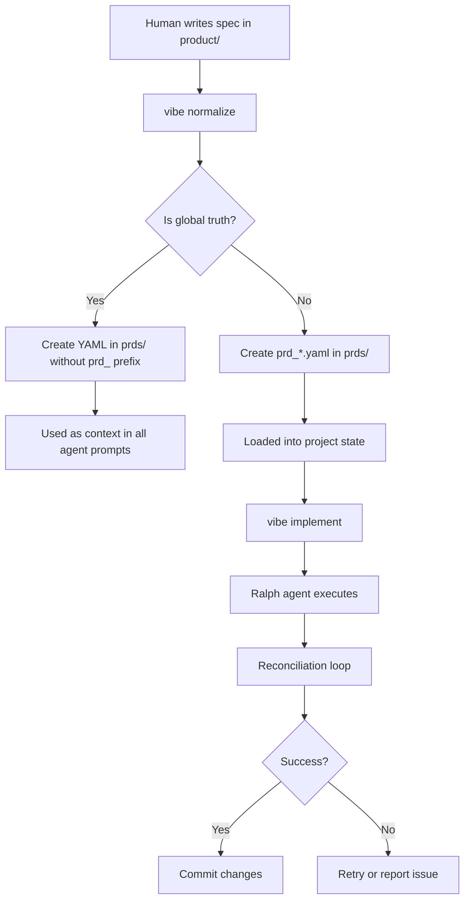
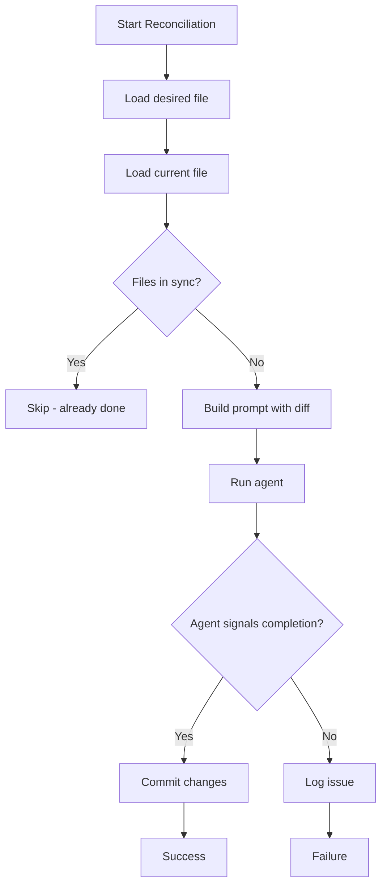
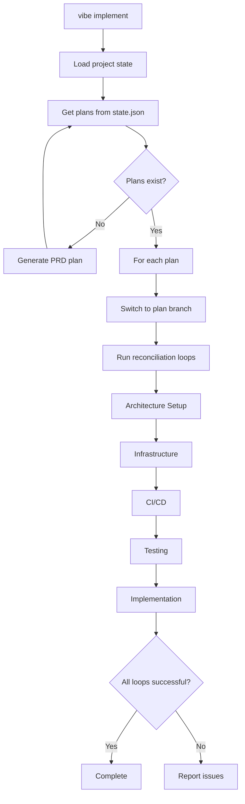

# Architecture

## System Architecture Overview

vibe-tools is built around a modular, CLI-first architecture that separates concerns into distinct components while maintaining a unified interface through the `vibe` command.

## Project Structure

```
/
├── vibe_tools/              # Core Python package
│   ├── cli.py              # Main CLI entry point and command registration
│   ├── utils.py            # Core utilities, path definitions, and helpers
│   ├── ralph.py            # Ralph agent integration and reconciliation loops
│   ├── architect.py        # Interactive architecture manager
│   ├── pm.py               # Interactive product manager
│   ├── normalize.py        # PRD normalization engine
│   ├── coverage.py         # Test coverage improvement loops
│   ├── fixer.py            # Test fixing automation
│   ├── cost.py             # Cost tracking and logging
│   ├── servers.py          # Local server management
│   ├── setup.py            # Service configuration
│   ├── testing.py          # Test execution utilities
│   ├── templates.py         # File templates
│   └── commands/           # Individual command implementations
│       ├── __init__.py     # Command registration
│       ├── architect.py
│       ├── pm.py
│       ├── normalize.py
│       ├── implement.py
│       ├── coverage.py
│       └── ... (30+ command modules)
├── product/                  # Human-readable specifications
│   ├── architecture.md     # System architecture spec
│   ├── infrastructure.md   # Infrastructure spec
│   └── *.md                # Feature PRDs
├── prompts/                # AI prompt templates
│   ├── ralph_base_prompt.txt
│   ├── reconciliation_prompt.txt
│   ├── architect_prompt.txt
│   ├── pm_prompt.txt
│   └── ... (other prompts)
├── implementation/                # Generated and runtime data
│   ├── prds/               # Normalized YAML PRDs
│   │   ├── architecture.yaml
│   │   ├── infrastructure.yaml
│   │   └── prd_*.yaml      # Feature PRDs
│   ├── logs/               # Execution logs
│   ├── costs/              # Cost tracking CSV files
│   ├── instructions/       # Global agent instructions
│   ├── state.json          # Project state management
│   └── config.json         # Project configuration
└── tests/                  # Test suite
```

## Core Components

### 1. CLI Layer (`vibe_tools/cli.py`)

The CLI layer provides the unified command interface using Click. It implements:
- Command ordering and organization
- Global options (debug, verbose, stream, agent)
- Configuration loading and context management
- Command registration from the `commands/` module

### 2. Utilities (`vibe_tools/utils.py`)

Core utilities module providing:
- **Path Management**: Centralized definitions for all project paths
- **Configuration Management**: Loading and saving config files
- **State Management**: Project state persistence in `state.json`
- **Agent Execution**: Wrapper functions for running AI agents
- **Logging**: Structured logging with file and console outputs
- **Git Operations**: Branch management and commit automation
- **File Operations**: Hash checking, content comparison, migration

### 3. Ralph Integration (`vibe_tools/ralph.py`)

The Ralph integration layer handles:
- **RalphLoop**: Reconciliation between desired and current state
- **QuickFixLoop**: Generic quick-fix loops using direct LLM calls
- **Implementation Loop**: Orchestrates PRD implementation across multiple plans
- **Branch Management**: Automatic branch creation and switching

### 4. Interactive Tools

#### Architect (`vibe_tools/architect.py`)
- Interactive shell for managing architecture and infrastructure specs
- Session persistence
- Context management with file attachments
- Two modes: ASK (advisory) and AGENT (authorized to modify files)

#### PM (`vibe_tools/pm.py`)
- Interactive shell for managing PRDs and specifications
- PRD lifecycle management
- Focus mode for working on specific PRDs
- Integration with project state

### 5. Normalization Engine (`vibe_tools/normalize.py`)

Converts human-readable markdown specs into machine-readable YAML PRDs:
- Processes all `.md` files in `product/`
- Generates `prd_*.yaml` files in `implementation/prds/`
- Handles global truths (architecture, infrastructure, etc.) differently from feature PRDs
- Uses AI agent to ensure proper YAML structure

### 6. Cost Tracking (`vibe_tools/cost.py`)

Tracks LLM usage costs:
- Token estimation
- Cost calculation per model
- CSV logging to `implementation/costs/usage.csv`
- Google Sheets integration (optional)
- Session cost reporting

### 7. Server Management (`vibe_tools/servers.py`)

Manages local development servers via Docker:
- Service definitions (Postgres, Redis, RabbitMQ, etc.)
- Container lifecycle (install, start, stop, remove)
- Port mapping and configuration
- Global server configuration storage

## Data Flow

### PRD Workflow



### Reconciliation Loop



### Implementation Flow



## File Organization Conventions

### Specs Directory (`product/`)
- Human-readable markdown files
- Naming: `NN_description.md` (e.g., `01_pm_prd_focus.md`)
- Global truths: `architecture.md`, `infrastructure.md`, `cicd.md`, `testing.md`

### PRDs Directory (`implementation/prds/`)
- Machine-readable YAML files
- Global truths: `architecture.yaml`, `infrastructure.yaml`, etc. (no `prd_` prefix)
- Feature PRDs: `prd_*.yaml` (must have `prd_` prefix)

### Project Directory (`implementation/`)
- All generated and runtime data
- Configuration: `config.json`
- State: `state.json`
- Logs: `logs/` directory
- Costs: `costs/` directory
- Instructions: `instructions/` directory

## Key Design Patterns

### 1. CLI-First Design
All functionality exposed through command-line interfaces, enabling:
- Scriptability
- Automation
- Integration with other tools
- Consistent developer experience

### 2. State-Driven Execution
Project state in `state.json` drives:
- Which PRDs to implement
- Current phase of implementation
- Branch associations
- Plan granularity

### 3. Reconciliation Pattern
Desired state (YAML) vs Current state (codebase):
- Agent-driven reconciliation
- Automatic commit on success
- Branch isolation per reconciliation step

### 4. Global Truths Pattern
Certain specs are treated as persistent context:
- Injected into every agent prompt
- Not implemented as features
- Updated through interactive tools (`vibe architect`, `vibe pm`)

### 5. Loop-Based Automation
Iterative improvement loops:
- Coverage improvement loop
- Test fixing loop
- Reconciliation loops
- Implementation loops

## Extension Points

### Adding New Commands
1. Create module in `vibe_tools/commands/`
2. Implement command function with Click decorator
3. Register in `vibe_tools/commands/__init__.py`

### Adding New Prompts
1. Add prompt file to `prompts/`
2. Reference via `get_prompt()` utility
3. Use in command or loop implementation

### Adding New Services
1. Define service in `vibe_tools/servers.py` DEFAULT_SERVER_CONFIGS
2. Add setup command in `vibe_tools/setup.py`
3. Update configuration schema

## Dependencies

- **Click**: CLI framework
- **PyYAML**: YAML parsing and generation
- **rich**: Terminal formatting
- **google-genai**: LLM orchestration for PRD generation
- **gspread**: Google Sheets integration
- **pytest**: Testing framework

See [Development](11-development.md) for more details on extending the system.
