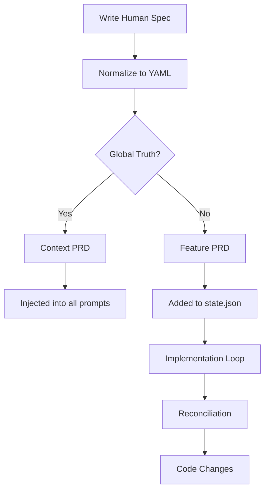

# PRD Workflow

## PRD-Driven Development Philosophy

vibe-tools follows a **PRD-Driven Development** approach where all changes start with Product Requirements Documents. This ensures:

- Clear requirements before implementation
- Machine-readable specifications for automation
- Version-controlled documentation
- Traceability from spec to code

## Workflow Overview



## Step 1: Create Human Specifications

Start by writing human-readable markdown specifications in the `product/` directory.

### Global Truths

Certain specifications represent persistent system state and are treated as "global truths":

- **`product/architecture.md`**: System architecture
- **`product/infrastructure.md`**: Infrastructure configuration
- **`product/cicd.md`**: CI/CD pipeline configuration
- **`product/testing.md`**: Testing strategy and configuration
- **`product/build.md`**: Build configuration
- **`product/project_overview.md`**: Project overview and context

These files are:
- Converted to YAML without the `prd_` prefix
- Injected into every agent prompt as context
- Not implemented as features, but used for guidance

### Feature PRDs

Feature PRDs follow a naming convention:
- `01_feature_name.md`
- `02_another_feature.md`
- Can be organized in subdirectories

Example structure:
```
product/
├── architecture.md
├── infrastructure.md
├── 01_user_authentication.md
├── 02_payment_processing.md
└── features/
    └── 03_search_functionality.md
```

### Creating PRDs

**Option 1: Interactive PM Tool**
```bash
vibe pm
```
- Interactive shell for creating and editing PRDs
- AI-assisted PRD generation
- See [Interactive Tools](08-interactive-tools.md)

**Option 2: Manual Creation**
- Create markdown files in `product/`
- Follow PRD template structure
- Use clear, structured format

## Step 2: Normalize Specifications

Convert human-readable specs to machine-readable YAML:

```bash
vibe normalize
```

### Normalization Process

1. **Scans `product/` directory** for all `.md` files
2. **Determines PRD type**:
   - Global truths → `*.yaml` (no prefix)
   - Features → `prd_*.yaml` (with prefix)
3. **Creates normalization branch**: `vibe/normalize/<prd_name>`
4. **Uses AI agent** to convert markdown to structured YAML
5. **Validates YAML** syntax and structure
6. **Saves to `implementation/prds/`**

### Normalization Options

**Normalize all specs:**
```bash
vibe normalize
```

**Normalize specific spec:**
```bash
vibe normalize infrastructure
vibe normalize product/01_feature.md
```

**Auto-overwrite existing:**
```bash
vibe normalize --yes
```

**Debug mode:**
```bash
vibe normalize --debug
```

### Output Structure

**Global Truths:**
```
implementation/prds/
├── architecture.yaml
├── infrastructure.yaml
├── cicd.yaml
└── testing.yaml
```

**Feature PRDs:**
```
implementation/prds/
├── prd_01_feature_name.yaml
├── prd_02_another_feature.yaml
└── features/
    └── prd_03_search_functionality.yaml
```

### YAML Structure

Normalized PRDs follow a consistent YAML structure:

```yaml
name: Feature Name
description: Brief description
requirements:
  - Requirement 1
  - Requirement 2
implementation:
  steps:
    - Step 1
    - Step 2
dependencies:
  - Other PRD or component
```

## Step 3: Project State Management

Normalized PRDs are tracked in `implementation/state.json`:

```json
{
  "phases": {
    "normalize": {"status": "completed"}
  },
  "plans": {
    "plan_1": {
      "prd_id": "prd_01_feature",
      "branch": "vibe/plan_1",
      "status": "pending"
    }
  }
}
```

### State Lifecycle

1. **Discovery**: PRDs found in `implementation/prds/`
2. **Planning**: PRDs grouped into implementation plans
3. **Implementation**: Plans executed in order
4. **Completion**: Status updated in state

## Step 4: Implementation

Run the implementation phase:

```bash
vibe implement
```

### Implementation Process

1. **Load project state** from `state.json`
2. **Generate plans** if not present
3. **For each plan**:
   - Switch to plan branch
   - Run reconciliation loops:
     - Architecture Setup
     - Infrastructure
     - CI/CD
     - Testing
     - Implementation
4. **Commit changes** on success
5. **Update state** with results

See [Ralph Integration](06-ralph-integration.md) for details on reconciliation.

## PRD Lifecycle

### States

- **`pending`**: PRD created but not started
- **`in_progress`**: Currently being implemented
- **`completed`**: Implementation finished
- **`failed`**: Implementation encountered errors
- **`blocked`**: Waiting on dependencies

### Managing PRD State

**Check status:**
```bash
vibe history
```

**Rerun PRD:**
```bash
vibe rerun prd_01_feature
```
- Resets PRD state
- Clears branch associations
- Allows fresh implementation

**Mark as implemented:**
```bash
vibe implemented
```
- Lists completed PRDs
- Option to reset if needed

## Global Agent Instructions

Instructions in `implementation/instructions/` are injected into every agent prompt:

```bash
vibe memory "Always use type hints in Python"
vibe memory "Follow PEP 8 style guide"
```

These instructions:
- Applied to all agent interactions
- Stored in `implementation/instructions/` directory
- Read automatically by agent execution

## Best Practices

### Writing PRDs

1. **Be specific**: Clear requirements reduce ambiguity
2. **Include examples**: Help AI understand intent
3. **Define boundaries**: What's in scope vs out of scope
4. **Reference dependencies**: Link to other PRDs or components
5. **Use structured format**: Headers, lists, code blocks

### Normalization

1. **Review before normalizing**: Ensure spec is complete
2. **Test normalization**: Use `--debug` to see process
3. **Verify YAML output**: Check generated YAML structure
4. **Update incrementally**: Normalize changed specs only

### State Management

1. **Check state regularly**: `vibe status`
2. **Track dependencies**: Ensure prerequisites are met
3. **Use rerun carefully**: Resets all progress
4. **Keep state.json clean**: Remove completed/obsolete plans

### Global Truths

1. **Update through tools**: Use `vibe architect` for architecture
2. **Keep in sync**: Ensure YAML matches markdown
3. **Version control**: Track changes to global truths
4. **Review impact**: Changes affect all agent prompts

## Troubleshooting

**PRD not found:**
- Check `product/` directory exists
- Verify file has `.md` extension
- Run `vibe normalize` to generate YAML

**Normalization fails:**
- Check markdown syntax
- Use `--debug` to see agent output
- Verify AI agent is configured

**State out of sync:**
- Check `implementation/state.json`
- Run `vibe status` to see current state
- Use `vibe rerun` to reset if needed

**Global truths not updating:**
- Use `vibe architect` to update architecture
- Ensure normalization runs after changes
- Check YAML files in `implementation/prds/`

See [Troubleshooting](12-troubleshooting.md) for more help.
