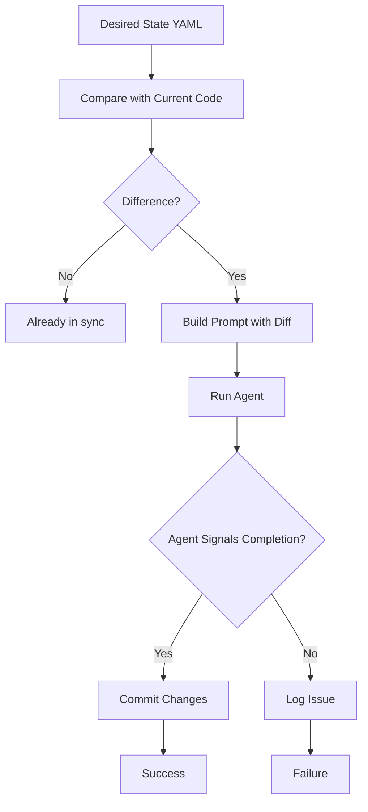
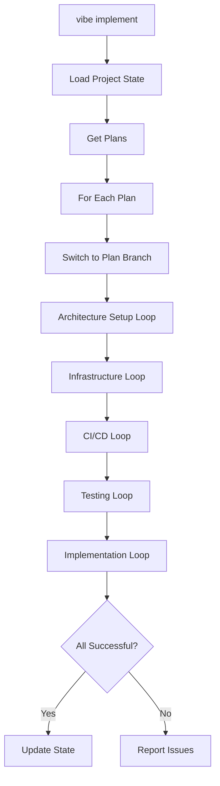

# Ralph Integration

## Overview

Ralph is the AI agent integration layer in vibe-tools. It handles automated reconciliation between desired state (YAML PRDs) and actual state (codebase), enabling AI-driven implementation.

## Agent Types

vibe-tools supports multiple agent types:

- **`cursor-agent`** (default): Cursor's agent integration
- **`claude`**: Claude API integration
- **`antigravity`**: Alternative agent implementation

Select agent with `--agent` flag:
```bash
vibe implement --agent claude
```

## Reconciliation Loop

The core pattern in Ralph integration is the **Reconciliation Loop**.

### Concept

Reconciliation ensures the codebase matches the desired state defined in YAML PRDs:



### RalphLoop Class

The `RalphLoop` class implements reconciliation:

```python
loop = RalphLoop(
    name="Architecture Setup",
    desired_file=pathlib.Path("implementation/prds/architecture.yaml"),
    current_file=pathlib.Path("implementation/architecture-current.yaml"),
    agent="cursor-agent",
    stream=False,
    branch_name="vibe/architecture"
)
success = loop.run()
```

### Reconciliation Process

1. **Load Files**: Read desired (YAML) and current (codebase state) files
2. **Sync Check**: Compare file hashes to detect changes
3. **Mode Detection**: 
   - `INITIALIZATION`: Current file doesn't exist
   - `MIGRATION`: Current file exists but differs
4. **Prompt Building**: Create prompt with:
   - Desired content
   - Current content (or "NOT FOUND")
   - Custom instructions
   - Mode information
5. **Agent Execution**: Run agent with reconciliation prompt
6. **Completion Check**: Verify agent signals completion with `<promise>DONE</promise>`
7. **Commit**: Automatically commit changes on success

### Completion Promise

Agents must signal completion with:
```
<promise>DONE</promise>
```

This ensures the agent has finished its work before the loop considers it complete.

## Implementation Loop

The implementation loop orchestrates multiple reconciliation steps:



### Loop Sequence

1. **Architecture Setup**: Ensures project structure matches architecture spec
2. **Infrastructure**: Configures infrastructure components
3. **CI/CD**: Sets up continuous integration/deployment
4. **Testing**: Configures testing framework
5. **Implementation**: Implements feature code

Each step runs as a separate reconciliation loop.

## QuickFixLoop

For simpler fixes that don't require full reconciliation:

```python
loop = QuickFixLoop(
    name="Fix Tests",
    success_fn=lambda: run_tests().returncode == 0,
    prompt_builder=lambda i: f"Fix failing tests (attempt {i})",
    max_iterations=5,
    model="gemini-3-flash"
)
success = loop.run()
```

### Characteristics

- Uses direct LLM calls (no agent wrapper)
- Takes a success function to determine completion
- Iterates until success or max iterations
- Simpler than full reconciliation

## Branch Management

Ralph automatically manages git branches:

### Branch Naming

- **Normalization**: `vibe/normalize/<prd_name>`
- **Reconciliation**: `vibe/<step_name>`
- **Implementation**: `vibe/plan_<id>` or `feature/<prd_id>`
- **Automerge**: Uses configured automerge branch if enabled

### Branch Operations

1. **Create branch** if it doesn't exist
2. **Switch to branch** before reconciliation
3. **Commit changes** on success
4. **Return to main** after completion (if not automerge)

### Automerge Mode

When `ralph.auto_merge` is enabled:
- All work happens on automerge branch
- Branch is kept in sync with main
- Automatic merging after successful implementation

## Agent Execution

### Command Generation

Agent commands are generated based on agent type:

```python
cmd = get_agent_command(agent="cursor-agent", prompt="...")
```

### Execution

```python
output, exit_code = run_agent(
    cmd,
    stream=False
)
```

### Streaming

Enable real-time output:
```bash
vibe implement --stream
```

### Caffeinate

Prevent system sleep during long runs:
```bash
vibe implement
```

## Cost Tracking

All agent executions are tracked for cost:

- **Token estimation**: ~4 characters per token
- **Cost calculation**: Based on model pricing
- **Logging**: CSV and optional Google Sheets
- **Session reporting**: Summary at exit

See [Cost Tracking](10-cost-tracking.md) for details.

## Debugging Loops

### Debug Mode

Enable detailed logging:
```bash
vibe implement --debug
```

### Manual Inspection

Check reconciliation state:
```bash
# View desired state
cat implementation/prds/architecture.yaml

# View current state
cat implementation/architecture-current.yaml

# Check git status
git status
```

### Common Issues

**Agent doesn't signal completion:**
- Check prompt format
- Verify agent is configured correctly
- Review agent output for errors

**Reconciliation fails:**
- Check file paths are correct
- Verify YAML syntax
- Review agent output for clues

**Branch conflicts:**
- Use `vibe branch-resolve` to fix
- Check branch lineage in state.json
- Manually resolve if needed

## Configuration

### Ralph Settings

In `implementation/config.json`:

```json
{
  "ralph": {
    "review": true,
    "tests": true,
    "auto_merge": false
  }
}
```

### Iteration Limits

```json
{
  "iterations": {
    "implementation": 10,
    "debug": 5
  }
}
```

## Best Practices

### Reconciliation

1. **Keep YAMLs up to date**: Ensure desired state reflects requirements
2. **Review agent output**: Check what changes are being made
3. **Test after reconciliation**: Verify changes work as expected
4. **Commit frequently**: Let Ralph commit automatically

### Agent Selection

1. **Use cursor-agent for development**: Best integration with Cursor
2. **Use claude for complex reasoning**: Better for architectural decisions
3. **Test different agents**: Find what works best for your use case

### Branch Management

1. **Use automerge for linear development**: Simpler branch structure
2. **Use feature branches for parallel work**: Better isolation
3. **Keep branches in sync**: Regular merges prevent conflicts

### Monitoring

1. **Check costs regularly**: Use `vibe cost`
2. **Review logs**: Check `implementation/logs/` for details

## Advanced Usage

### Custom Instructions

Add instructions to reconciliation loops:

```python
loop = RalphLoop(...)
loop.instructions = [
    "Always use type hints",
    "Follow PEP 8 style"
]
loop.run()
```

### Custom Success Functions

For QuickFixLoop:

```python
def check_success():
    result = subprocess.run(["pytest"], capture_output=True)
    return result.returncode == 0

loop = QuickFixLoop(
    name="Fix Tests",
    success_fn=check_success,
    prompt_builder=lambda i: f"Fix tests (attempt {i})"
)
```

### Multiple Plans

Implementation loop processes multiple plans:

```json
{
  "plans": {
    "plan_1": {...},
    "plan_2": {...}
  }
}
```

Plans are executed in order, with dependencies respected.

## Troubleshooting

See [Troubleshooting](12-troubleshooting.md) for common issues and solutions.
