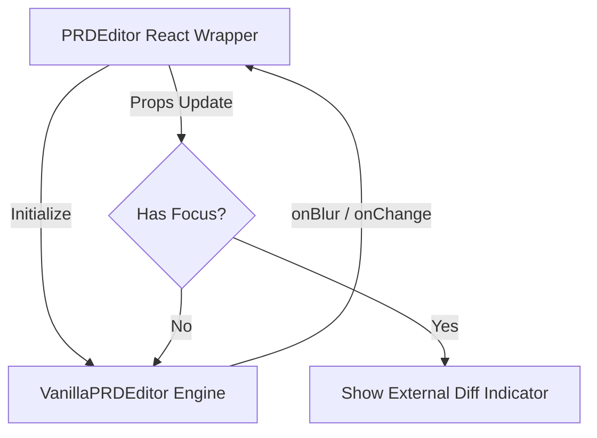

# PRDEditor Architecture

## Overview
The PRDEditor is a hybrid Markdown editor that combines the power of React for the UI wrapper with a Vanilla JavaScript engine (`VanillaPRDEditor`) for the actual editing experience. This separation is intentional to ensure high performance and stable text selection, which are often compromised when React's reconciliation cycle interferes with a `contenteditable` element.

## Why Vanilla JavaScript?
React's rendering cycle can be unpredictable when dealing with `contenteditable`. Every state change that triggers a re-render can cause the DOM to be recreated or updated in a way that loses the user's cursor position (selection). By isolating the editing engine in vanilla JS, we maintain full control over the DOM and the selection API.

## Components

### 1. `PRDEditor.tsx` (React Wrapper)
- **Role**: Manages the integration with the rest of the application.
- **State Management**: Holds the "synced" version of the document.
- **External Updates**: Implements logic to prevent overwriting the editor while it has focus.
- **Preview Mode**: Uses `react-markdown` to show a high-fidelity preview of the content.
- **Toolbar**: Provides UI buttons that trigger commands in the vanilla engine.

### 2. `VanillaPRDEditor.ts` (Core Engine)
- **Role**: Directly manages the `contenteditable` element.
- **Commands**: Exposes a `runCommand(command, value)` method. This is the primary way the "outside" (React) communicates with the "inside" (Vanilla) without triggering React re-renders. It supports:
    - Standard `execCommand` actions (bold, italic, lists).
    - Custom complex actions (inserting PRD-specific details blocks, comments, or checklists).
- **Markdown Conversion**:

## Data Flow



## Special Features
- **Visual Boundary**: The vanilla editing area is marked with a subtle green left border and a "Vanilla JS Engine Area" label in the UI to clearly indicate where React's rendering lifecycle is bypassed.
- **Smart Pasting**: Automatically detects if pasted text is Markdown or HTML and converts it to the editor's internal format.
- **External Sync**: If changes happen to the PRD file outside the editor while it's open, the editor will show an "External Diff" badge and wait for the user to manually sync or finish editing.
- **PRD Specific Tags**: Robust support for `<details>`, `<summary>`, and checklist items (`- [ ]`).

## Maintenance Rules
1. **Do NOT** move the `contenteditable` logic back into React state.
2. **Do NOT** trigger re-renders of the editor container while `editorRef.current.getIsFocused()` is true.
3. **Always** update both `markdownToHtml` and `htmlToMarkdown` when adding new formatting features to ensure bidirectional consistency.

---

<details>
<summary>Metadata</summary>

```yaml
id: DOC-015
title: PRDEditor Architecture
type: DOCUMENTATION
status: active
```

</details>

<!-- vibe-id: DOC-015 -->
